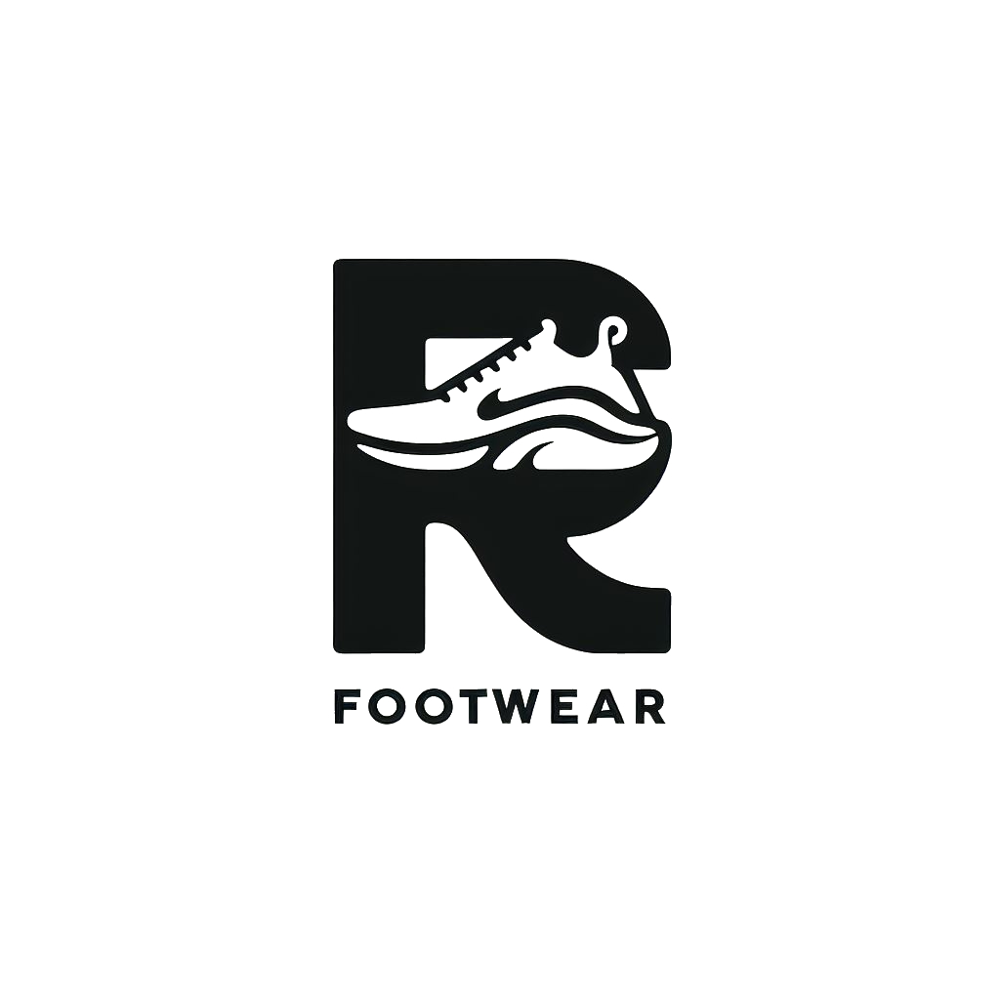

# ANTEPROYECTO

## RE-FOOTWEAR

| Autor: Rafael Bocanegra Rodríguez |
|-----------------------------------|
| I.E.S Francisco Romero Vargas (Jerez de la Frontera) |
| Desarrollo de Aplicaciones Web (DAW) |
| Curso: 2023/2024                     |

## Índice
1. [Introducción](#introducción)
2. [Finalidad](#finalidad)
3. [Objetivos](#objetivos)
4. [Medios necesarios](#medios-necesarios)
5. [Planificación](#planificación)

## Introducción
Este proyecto consta de una página web, creada y dedicada únicamente a la reventa de zapatillas. La página llamada “Re-footwear” se encarga de que los propios usuarios ya registrados en dicha web puedan subir sus propias zapatillas para poder así venderlas a los demás que estén interesados en este mundo. Al seleccionar un producto, los usuarios serán redirigidos a una página detallada que proporcionará información completa sobre el par de zapatillas elegido, incluyendo su estado y características únicas. 

## Finalidad
El propósito central de este proyecto es crear una plataforma web altamente intuitiva que satisfaga las necesidades tanto de los entusiastas de las zapatillas como de los vendedores. La web estará diseñada para proporcionar una experiencia de navegación fluida y accesible para todos los usuarios, desde aquellos que buscan adquirir zapatillas únicas hasta aquellos que desean vender sus pares. A continuación, se destacan ciertos apartados a cumplir:

- **Amplia variedad de zapatillas:** La plataforma contendrá una extensa colección de zapatillas de segunda mano, cuidadosamente clasificadas por diferentes estilos, marcas y modelos. Esto permitirá a los clientes encontrar rápidamente las zapatillas que se adapten a sus preferencias y gustos personales.
- **Proceso de compra y venta:** Los usuarios tendrán la capacidad de comprar y vender zapatillas de manera sencilla a través de la web. Se facilitará un proceso de compra seguro y transparente, así como también un sistema eficiente para que los vendedores puedan listar y gestionar sus productos de forma organizada.
- **Noticias y nuevas existencias:** Al entrar en la página web, habrá una sección de noticias de las nuevas zapatillas que han salido a la venta de las diferentes marcas internacionales.

## Objetivos
- **Desarrollo de Funcionalidad de búsqueda por filtro:**  Implementar un sistema de búsqueda que permita a los usuarios encontrar zapatillas específicas según marca, modelo, tamaño, condición, precio, y otros atributos relevantes.  

- **Implementación de Secciones Específicas:** Incluir secciones predefinidas como "Más Populares" para facilitar la exploración y navegación de los usuarios, ayudándoles a descubrir rápidamente los lanzamientos más recientes y populares.

- **Usuarios y sus propios perfiles:** Todos los usuarios tendrán acceso a su propio perfil, el cual puede ser editado e incluirá todo tipo de compras o ventas que hayan sido realizadas, así como las valoraciones.

- **Sistema de venta:** Se realizará un sistema de ventas, el cuál será muy sencillo de entender y utilizar, en el que los usuarios podrán vender sus propias zapatillas partiendo de fotografías de las mismas y características principales de ellas.

- **Optimización de la Experiencia del Usuario:** Garantizar que la plataforma sea fácil de usar y que ofrezca una experiencia fluida y atractiva para los usuarios, desde la búsqueda y selección de zapatillas hasta el proceso de compra.

## Medios necesarios 
### Hardware y software:
- **Mi PC:** Este proyecto será realizado en mi equipo, el cuál es suficientemente potente para poder realizar este trabajo
- **Entorno de desarrollo:** En este caso utilizaré Visual Studio Code porque es con el cuál más me familiarizo
- **Base de datos:** En ella gestionaré todos los productos de esta página web, así como la gestión de usuarios
- **Recursos gráficos:**  Realizaré una plantilla visual para organizar el diseño de la web, e incluir imágenes de todo tipo de zapatillas.

- **Acceso a internet:** Conexión totalmente fiable sin problemas

## Planificación
**En la primera semana** me encargaré de crear el proyecto y la base de datos con la que va asociada, así como empezando la codificación de la página web.
**En la segunda semana** seguiré con la codificación de esta, y puliendo todo tipo de errores de código base.
**En la tercera y cuarta** semana iré implementando diseño a la página, para que se vea más elegante y atractiva.
**En la quinta y sexta semana** introduciré las secciones, imágenes y filtros para la fácil intuición dedicada a los usuarios.
**En la séptima y octava** semana me dedicaré sobre todo a la gestión de los usuarios, así como los registros e interfaces de ello, como los perfiles.
**En la novena y décima semana** terminaré con el proyecto, así dando sus últimos retoques y comprobando que no haya fallos de ningún tipo.

***Se estima un total de 55-64 horas de realización para el proyecto.***

